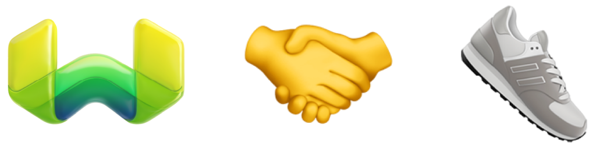

# Generative Shoe Finder with Weaviate

 

## Project Overview

With **Generative Shoe Finder**, I explore Weaviate's vector database and delve into **generative search**, also known as Retrieval Augmented Generation (RAG).

## Objective

The goal is to create a simple use case: **recommending running shoes in a understandable way for those non-runnerds too** –that is, also for the unfamiliar with various brands, models, goals, fits, innovations and trends. As a running enthusiast, I often get asked questions like:

- "What are some running shoes that you would recommend me?"
- "My shoes are too narrow, do you know some that do not hurt my feet?"
- "I just want some shoes that are comfortable for everyday training and won't get me injured"

## Approach

Online forums and chats address these questions individually but fail to synthesize the wealth of information available from online reviews. This project aims to experiment with a scalable, LLM-based approach for niche market understanding, applicable to various fields in online media and shopping.

## Methodology

- Utilize Weaviate Cloud Sandbox as a starting point
- Create a dataset from running shoe reviews on [*Doctors of Running*](https://www.doctorsofrunning.com/)
- Upload chunked documents to a collection in WCS
- Perform generative search using OpenAI's GPT-4 model to:
  - interpret the retrieved information
  - return a recommendation in brief, but easy to follow, way

## Deliverables

This interactive Python notebook includes all steps related to early development and data preparation. The final output is a simple Streamlit frontend hosted on their public cloud. Feel free to adjust any part to better fit your needs!

- The main notebook: [workflow.ipynb](workflow/workflow.ipynb)
- The Streamlit frontend: [generative-shoe-finder.streamlit.app](https://generative-shoe-finder.streamlit.app/)

Enjoy!
